<!-- ============================================================
     SPIDER-MAN GITHUB PROFILE — DevWrapped Theme
     Theme: Spider-Verse | ID: spiderman
     Built with: SMIL SVG animations, GitHub Actions, spider-lore
     ============================================================ -->

<!-- HERO INTRO -->

  

<!-- ============================================================
     SECTION 02 — HERO PROFILE
     ============================================================ -->

  

  

  
  
  
  

  <i>"With great code comes great responsibility."</i> 
  Built <b>PulseWatch</b> (uptime SaaS) — a product that runs while I sleep.

<!-- ============================================================
     SECTION 03 — SPIDER-SENSE STATUS
     ============================================================ -->

  

  

<!-- ============================================================
     SECTION 04 — HERO STATS (spider-lore terminology)
     ============================================================ -->

  

  

  

<!-- ============================================================
     SECTION 05 — WEB STREAK
     ============================================================ -->

  

  

  

<!-- ============================================================
     SECTION 06 — WEB ARSENAL
     ============================================================ -->

  

  

  

<!-- ============================================================
     SECTION 07 — WEB SWING (52-week activity)
     ============================================================ -->

  

  

<!-- ============================================================
     SECTION 08 — CURRENT MISSION (flagship project)
     ============================================================ -->

  

  

<table>
  <tr>
    <td width="100%" valign="top">
      <h3>PulseWatch</h3>
      
<b>Uptime monitoring SaaS</b> — a full-stack platform that tracks website and API availability in real-time, with intelligent alerting and performance analytics.

      

        
        
        
        
      

      

        
        
      

      

        
        
      

    </td>
  </tr>
</table>

<!-- ============================================================
     SECTION 09 — WEB MISSIONS (project cards)
     ============================================================ -->

  

  

<table>
  <tr>
    <td width="50%" valign="top">
      <h3>PulseWatch</h3>
      
Self-hosted uptime monitoring with Telegram alerts, AI-explained incidents, and public status pages. FastAPI + React/Vite/TS.

      

        
        
      

    </td>
    <td width="50%" valign="top">
      <h3>RepoPages</h3>
      
Turn any GitHub repository into a beautiful, AI-generated product website. RepoPages analyzes your README, codebase, and project metadata to generate polished landing pages you can customize.

      

        
        
      

    </td>
  </tr>
  <tr>
    <td width="50%" valign="top">
      <h3>DevWrapped</h3>
      
Turn your GitHub activity into a beautiful, shareable annual story. Discover your coding stats, streaks, personality, and developer archetype.

      

        
        
      

    </td>
    <td width="50%" valign="top">
      <h3>Nira AI</h3>
      
Locally-hosted, privacy-first AI assistant with a FastAPI backend and a React PWA frontend. Streams voice replies and orchestrates tools — browser, terminal, files, weather, search.

      

        
        
      

    </td>
  </tr>
  <tr>
    <td width="50%" valign="top">
      <h3>Clean City</h3>
      
Community environmental issue reporting app — report trash, pollution &amp; hazards on an interactive map. React + Vite + Leaflet frontend, Express + MongoDB backend.

      

        
        
      

    </td>
    <td width="50%" valign="top">
      <h3>Atnasya Health</h3>
      
Full-stack menstrual cycle tracking app with period prediction, symptom logging, and cycle history analytics.

      

        
        
      

    </td>
  </tr>
</table>

<!-- ============================================================
     SECTION 10 — HERO ACHIEVEMENTS
     ============================================================ -->

  

  

  

<!-- ============================================================
     SECTION 11 — CONTRIBUTION GRAPH
     ============================================================ -->

  

  

  

<!-- ============================================================
     SECTION 12 — SPIDER-SENSE NETWORK (socials)
     ============================================================ -->

  

  

  
  
  
  

  <i>Open to collaborations, consultations, and friendly neighborhood developer meetups.</i>

<!-- ============================================================
     SECTION 13 — FOOTER
     ============================================================ -->

  

  

<!-- Visitor Counter (optional) -->

  

<!-- ============================================================
     BUILD INFO
     Generated by: DevWrapped Spider-Man theme engine
     Theme version: 1.0.0
     Assets: 9 animated SVGs (hero, divider, spider-sense, hero-stats, streak-stats, footer, web-arsenal, web-swing, achievements)
     To refresh data: python tools/generate.py --username Robibiruk
     ============================================================ -->
